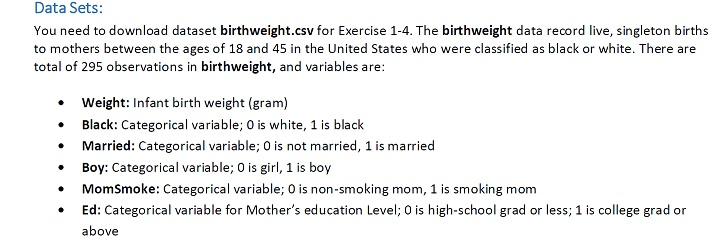
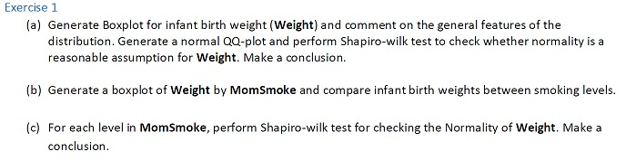
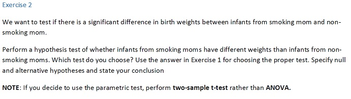
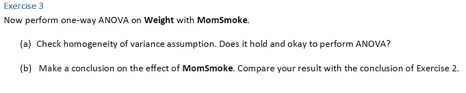
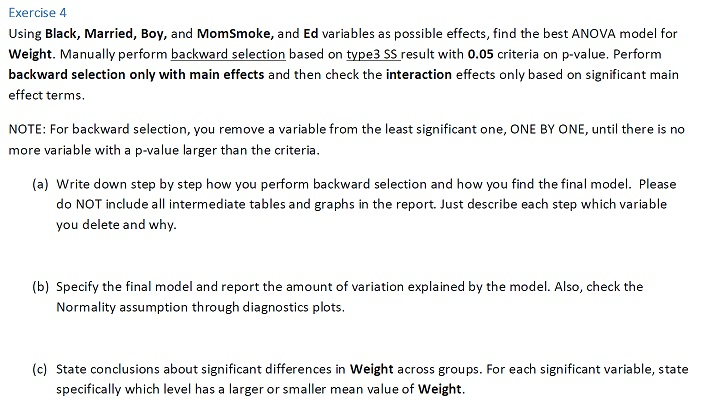

```{r setup, include=FALSE}
knitr::opts_chunk$set(echo = TRUE)

# Install required packages

# install.packages("MASS")
# install.packages("fBasics")
# install.packages("moments")
# install.packages("dplyr")
# install.packages("car")
#install.packages("DescTools")


library(MASS)
library(fBasics)
library(moments)
library(dplyr)
library(car)
library(DescTools)


```

    

***    
 
```{r}

# Read the CSV file
data.bweight <- read.csv("birthweight.csv",header = TRUE) 

# Check data format
str(data.bweight)


data.bweight$Black=as.factor(data.bweight$Black)
data.bweight$Married=as.factor(data.bweight$Married)
data.bweight$Boy=as.factor(data.bweight$Boy)
data.bweight$MomSmoke=as.factor(data.bweight$MomSmoke)
data.bweight$Ed=as.factor(data.bweight$Ed)

str(data.bweight)

```
 
***   
  
## Exercise 1:  
 
  
***    
 
#### Part (a):    
#### Answer -:   

```{r}
boxplot(data.bweight$Weight, main="Box plot for Infant birth weight",xlab="Weight",ylab="g (gram)",col = "aquamarine3",border = "aquamarine4")
points(mean(data.bweight$Weight),col="red",pch=16)


```

##### Comment:  
Mean is very closed to median, skewness is very closed to zero, Q1 and Q3 are almost symmetric, thus:   
data looks very normal distribution.  

```{r}
qqnorm(data.bweight$Weight)
qqline(data.bweight$Weight,col="red")

print(shapiro.test(data.bweight$Weight))
```

##### Comment:  
As QQ plot, most amount of points are closed to red line, thus normal distribution is reasonable.  

As the Shapiro-Wilk test result, the P-Value is large (>0.05), hence data follows normal distribution.  

#### Conclusion:  
Regarding to Box plot, QQ plot and Shapiro-Wilk test result, data for the "Weight" follows normal distribution.  


***  
#### Part (b):   
#### Answer -:  
```{r}
boxplot(data.bweight$Weight ~ data.bweight$MomSmoke,main="Box plot for Weight by Momsoking",xlab = "MomSmoke",ylab="Weight (gram)",col="aquamarine3",border="aquamarine4") 

mean.aggregate <- aggregate(data.bweight$Weight,list(data.bweight$MomSmoke),mean)
points(x = 1:nrow(mean.aggregate),                             # Add points to plot
       y = mean.aggregate$x,
       col = "red",
       pch = 16)

text(x = 1:nrow(mean.aggregate),                               # Add text to plot
     y = mean.aggregate$x +200,
     labels = paste("Mean:", round(mean.aggregate$x, 1)),
     col = "red")
```

##### Comment:  
The plot for moms who smoked (value=1), has lower min and max, lower Q1 and Q2 and lower mean and median, it seems the moms who smoked might have lower weight infants. 

Regarding the plots, mean and median are very close together, it seems both groups follows normal distribution.    


***  
#### Part (c):   
#### Answer -:  

```{r}

data.weight.momsnosmoked <- data.bweight[data.bweight$MomSmoke==0,]
print(shapiro.test(data.weight.momsnosmoked$Weight))


data.weight.momsmoked <- data.bweight[data.bweight$MomSmoke==1,]
print(shapiro.test(data.weight.momsmoked$Weight))

```

#### Conclusion:  
As the Shapiro-Wilk test results, the P-Value for both groups as large (> 0.05), hence both groups follows normal distribution.  


***  
## Exercise 2:  


***  


#### Answer -:  
Regarding to result of exercise 1, data follows a normal distribution and we have only one independent variable (MomSmoke) with two levels (0/1), thus we should choose a parametric Two-Sample T-Test.  

- H0: There is no Mom Smoking effect on infant's weight  
- H1: There exist Mom smoking effect.  

##### Step 1: Check variances equality   
```{r}
# Check the Variances
var.test(data.bweight$Weight ~ data.bweight$MomSmoke, alternative="two.sided")
```
P-Value >> 0.05 ===> Variances are equal.  

##### Step 2: Perform T-Test    
```{r}
t.test(data.bweight$Weight ~ data.bweight$MomSmoke,alternative="two.sided",var.equal=TRUE)
```

#### Conclusion:  
P-Value << 0.05 ===> We don't have any evidence to accept Null hypothesis.  
Thus:  
The mean of two groups are not equal, therefore, there exist significant effect on Mom smoking for weight of infants.  


*** 

## Exercise 3:  

***  

#### Part (a):   
#### Answer -:  


##### Step 1) Check Balancing  

```{r}
table(data.bweight$MomSmoke)
```
Data is unbalanced.  


##### Step 2) Perform One-Way ANOVA  
```{r}
e3.aov.a <-  aov(data=data.bweight, Weight ~ MomSmoke)
summary(e3.aov.a)
```
##### Step 3) Chack variance assumption     
We must check equality of variances with 2 ways:  
1) Levente Test  
2) Residuals diagram  

```{r}
leveneTest(e3.aov.a)
```
Based on levene test's result. P-Value >> 0.05 ===> variances assumption is reasonable   
```{r}
par(mfrow=c(2,2))
plot(e3.aov.a)
```

##### Comment     
Regarding to the Residuals plot, variances equality is reasonable.  
Thus, based on levene test and residuals plot:    
variances equality assumption for both groups are reasonable (Homogeneous variances), therefore  it's OK to perform one-way anova.  


***  


#### Part (b):   
#### Answer -:  


##### Calculate the R Square   

```{r}
e3.lm=lm(data=data.bweight, Weight ~ MomSmoke)
anova(e3.lm)
summary(e3.lm)$r.squared

```
This R Square is the percentage of variation in a response variable that is explained by the model.  

***  


##### Final Result:   
According the Part (a) - Step (2), P-Value << 0.05 ===> P-Value is statisticaly significant, thus we don't have any evidence to accept Null, therefore we reject Null.  

#### Conclussion:  
Mom smoke groups have different means, it means there exist mom smoke effect on weight of infants.  
This result is equal with the reult of Exercise 2 (Two-Way T-Test) and both methods have same results.  


***  

## Exercise 4:  
  

***  

#### Part (a):   
#### Answer -:  


##### Step 1) Make full model 
The full model with main effects is:  

Weight ~ Black + Married + Boy + MomSmoke + Ed   

##### Step 2) Perform ANOVA and Type III  

```{r}
e4.aov.a <- aov(data=data.bweight, Weight ~ Black + Married + Boy + MomSmoke + Ed)
Anova(e4.aov.a, type=3)

```

##### Step 3) Eliminate first variable    
We must eliminate the least significant variable (the biggest P-value)    

"ED" has the biggest P-Value, thus we will eliminate it.  
The next model is:   

Weight ~ Black + Married + Boy + MomSmoke 

##### Step 4) Perform ANOVA and Type III  
```{r}
e4.aov.a <- aov(data=data.bweight, Weight ~ Black + Married + Boy + MomSmoke)
Anova(e4.aov.a, type=3)
```
##### Step 5) Eliminate next least significant variable    

"Married" has the biggest P-Value, thus we will eliminate it.  
The next model is:   

Weight ~ Black + Boy + MomSmoke

##### Step 6) Perform ANOVA and Type III  
```{r}
e4.aov.a <- aov(data=data.bweight, Weight ~ Black + Boy + MomSmoke)
Anova(e4.aov.a, type=3)
```
##### Step 7) Eliminate next least significant variable    

"Boy" has the biggest P-Value, thus we will eliminate it.  
The next model is:   

Weight ~ Black + MomSmoke


##### Step 8) Perform ANOVA and Type III  
```{r}
e4.aov.a <- aov(data=data.bweight, Weight ~ Black + MomSmoke)
Anova(e4.aov.a, type=3)
```
##### Step 9) Cut-off     

There exist no more insignificant variables, thus we will stop elimination and, now we have the final model.  

Model with main effects is: Weight ~ Black + MomSmoke  

##### Step 10) Adding interaction for main effects       

```{r}
e4.aov.a.2 <- aov(data=data.bweight, Weight ~ Black + MomSmoke + Black * MomSmoke)
Anova(e4.aov.a.2, type=3)
```
P-Value for interaction >> 0.05 ====> interaction is not significant, thus we don't add interaction to final model.    


#### Conclussion:  
Final model will be:  

Weight ~ Black + MomSmoke   
   

***  
#### Part (b):   
#### Answer -:  

##### Step 1) Calculate R Square      
```{r}
e4.lm <- lm(data=data.bweight, Weight ~ Black + MomSmoke)
summary(e4.lm)$r.squared
```

This R Square is the percentage of variation in a response variable that is explained by the model.  

##### Step 2) Diagnostic plot  

```{r}
par(mfrow=c(2,2))
plot(e4.aov.a)

```
##### Result:  
According to QQ plot, normality assumption is reasonable, since, most points are closed to red line, thus we can judge data follows normality distribution.    

***  
#### Part (c):   
#### Answer -:  

We must perform a Post-hoc test to figure out about the differences.   

```{r}
TukeyHSD(e4.aov.a)
```
- Diff of "Black = 1/Black = 0" is "Negative", P-Value is small ==> µ(Black=1) < µ(Black=0)  
- Diff of "Momsmoke = 1/Momsmoke = 0" is "Negative", P-Value is small ==> µ(Momsmoke = 1) < µ(Momsmoke = 0) 


#### Conclussion:  
Mean of infant's weight of white moms is bigger than blacks.      
Mean of infant's weight of non-smoking moms is bigger than smoking moms.   


***